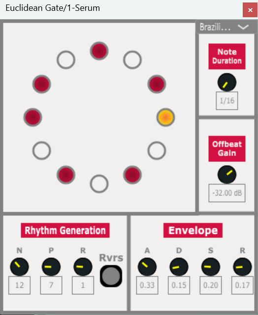

Euclidean Gate

A simple rhythmic gate plugin made using JUCE framework https://juce.com/

Generates rhythms using Euclidean algorithm as detailed in https://cgm.cs.mcgill.ca/~godfried/publications/banff.pdf

Features:
- Euclidean algorithm to generate rhythms, these rhythms are p number of pulses spaced evenly over n available beats, they can also be rotated by r
- ADSR envelope for each beat
- Volume of "off" beats is controllable, range from -INF dB(MIN) to 0 dB(MAX)
- Sliders to control all inputs for Euclidean algorithm, ADSR envelope, beat length, "off" beats volume
- Audiovisual display
- Preset options from mcgill paper e.g. Brazilian Necklace

Features in Development:
- New effects to be modulated by the gate

